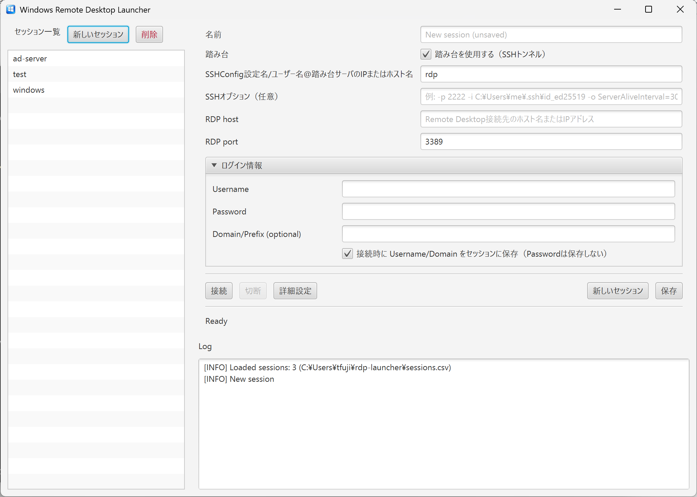

# Windows Remote Desktop Launcher (rdp-launcher)

Windows向けの **RDP（mstsc）起動ランチャー** です。  
踏み台サーバー経由が必要な環境でも、SSHトンネル（ローカルポートフォワード）を自動で張ってから `mstsc.exe` を起動できます。

- セッション（接続先）を一覧管理
- 踏み台ON/OFF（SSHトンネル）
- RDP詳細設定（Fullscreen / 解像度 / multimon / span）
- 認証情報は **パスワード非保存**（必要時のみ一時的に `cmdkey` で投入→終了時に削除）
- CSV（`~/rdp-launcher/sessions.csv`）でセッションを永続化

> ⚠️ 注意: 本アプリは Windows 専用です（`mstsc.exe`, `cmdkey.exe`, `ssh.exe`, PowerShell を使用）。

---

## Screenshots

---

## Features

### セッション管理
- 左のセッション一覧から選択 → 右フォームに読み込み
- 「新しいセッション」で新規作成
- 「保存」でCSVへ保存
- ダブルクリック / Enter で接続

### 踏み台（SSHトンネル）
- ON: `ssh -N -L 127.0.0.1:<freePort>:<rdpHost>:<rdpPort> ...` をバックグラウンドで起動
- ローカルポートが開くまで待機 → `mstsc /v:localhost:<freePort>` で接続
- OFF: 直接 `mstsc /v:<rdpHost>:<rdpPort>`

### 資格情報（Passwordは保存しない）
- Username + Password の場合: `cmdkey` で `TERMSRV/<host>` に一時登録 → mstsc終了後に削除
- Usernameのみの場合: `.rdp` を一時生成して username を渡し、パスワード入力を促す（prompt）
- Passwordのみ入力はエラー

---

## Requirements

- Windows 10/11
- JDK 22（開発/ビルド用）
- Gradle Wrapper（同梱の `gradlew` を使用）
- SSH クライアント（Windows標準の `ssh.exe` を想定）
- MSIインストーラー生成する場合:
  - WiX Toolset（jpackageのMSI生成で必要です）

---

## Project Structure

- `src/main/java/app/RdpLauncherApp.java` : メインアプリ
- `src/main/resources/app/` : リソース（アイコンなど）
- `build.gradle` : ビルド設定（JavaFX + jlink + jpackage）
- `gradlew` / `gradlew.bat` : Gradle Wrapper

---

# Build (Development)

## 依存取得・ビルド
.\gradlew clean build

## 実行（開発）
.\gradlew run

## Package (Installer / MSI)

事前に `JAVA_HOME` が JDK 22 を指していることを推奨します。  
`build.gradle` で `jpackageHome` を指定している場合はそちらが優先されます。

PowerShell:

    .\gradlew clean jpackage -PinstallerType=msi

生成物の例:
- `build/jpackage/Windows Remote Desktop Launcher/*.msi`
- または `build/jpackage/*.msi`

---

## Troubleshooting

### MSI が作れない（WiX が必要）

MSI 生成には WiX Toolset（`candle.exe`, `light.exe`）が必要になる場合があります。  
PATH が通っているか確認してください。

    where candle
    where light

## Security Notes

- Password はファイルに保存しません
- 自動ログインが必要な場合のみ、一時的に `cmdkey` へ登録します
- mstsc 終了時・アプリ終了時に削除するよう実装しています

## Data Location

セッション情報（パスワードなし）は以下に保存されます。

- `%USERPROFILE%\rdp-launcher\sessions.csv`

SSH の一時ログ（必要時）は以下に出力します。

- `%TEMP%\rdp-launcher-ssh-out.log`
- `%TEMP%\rdp-launcher-ssh-err.log`

---

## Contributing / Modifications

- 改変して利用する場合は、作者へ一報ください（用途・変更点が分かる程度でOK）
- 社内利用（組織内での利用）は問題にしません
- 第三者による販売（本体/改変版/バンドル含む）は許可しません
- 有償サービスへの組み込み（SaaS/有料保守契約/課金機能の一部など）も許可しません
- 無償配布はOKですが、再配布時は一報ください（配布先URL/配布形態が分かれば十分です）

連絡先: "https://github.com/o0w0v/Windows-Remote-Desktop-Launcher/issues"

---

## License

このリポジトリには `LICENSE` を同梱します。  
詳細は `LICENSE` を参照してください。
